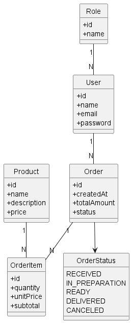
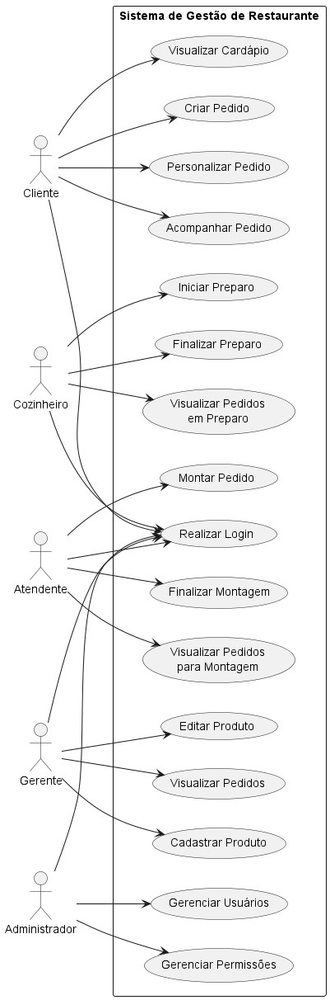

# Restaurant Order API

API REST para gerenciamento de pedidos e operações de restaurante, desenvolvida com Java e Spring Boot.

## Objetivo

Construir uma API REST para gerenciamento de pedidos, produtos e usuários em um restaurante, permitindo que clientes realizem pedidos e funcionários acompanhem todo o fluxo de preparação e entrega dos produtos.

## Problemas que o Sistema Resolve

* Organização dos pedidos
* Controle do fluxo de preparo
* Gerenciamento do cardápio
* Controle de usuários e permissões
* Acompanhamento dos status dos pedidos

## Tecnologias

* Java 21
* Spring Boot
* Spring Data JPA
* PostgreSQL
* Maven

## Status Atual

🚧 Em desenvolvimento

## MVP - Escopo da Primeira Entrega

O MVP será considerado concluído quando for possível:

1. Cadastrar usuários
2. Realizar login
3. Cadastrar produtos
4. Listar produtos
5. Criar pedidos
6. Adicionar produtos ao pedido
7. Alterar status dos pedidos
8. Visualizar pedidos
9. Controlar permissões por perfil de usuário

## Entidades do Domínio

* **Usuário (User)** - Pessoa que acessa o sistema
* **Perfil (Role)** - Administrador, Gerente, Atendente, Cozinheiro, Cliente
* **Produto (Product)** - Item disponível no cardápio
* **Pedido (Order)** - Solicitação realizada por um cliente
* **Item do Pedido (OrderItem)** - Produto dentro de um pedido
* **Status do Pedido (OrderStatus)** - RECEIVED, IN_PREPARATION, READY, DELIVERED, CANCELED

## Documentação

Para mais detalhes, consulte os arquivos de documentação na pasta `docs/`:

* [MVP](docs/mvp.md) - Definição do MVP e escopo
* [Entities](docs/domain-entities.md) - Entidades do domínio
* [Use Cases](docs/use-cases.md) - Casos de uso

### Diagramas

#### Modelo de Domínio

#### Diagrama de Casos de Uso

## Autor

Desenvolvido por [mvmomente](https://github.com/mvmomente) (Marcos Momente)